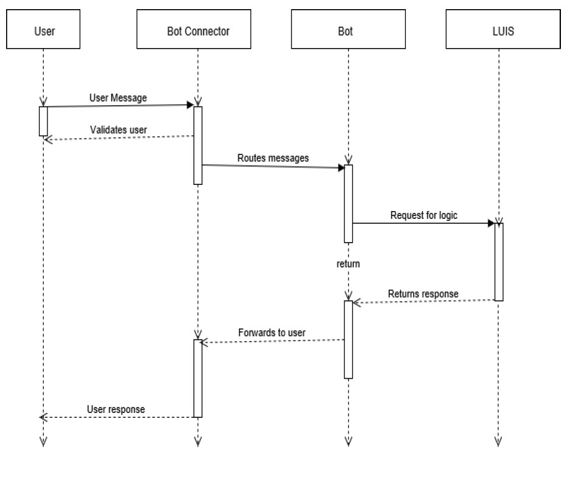

# Intelligent Bot using Cognitive Services - Bachelor's Thesis

**Intelligent Bot (iBot)** is a programmed application that performs an automated task in a conversational format. It is facilitated by `Microsoft Bot Framework` that consists of Bot Builder SDK,  Bot Connector, Bot Emulator. Language Understanding Intelligent Systems `(LUIS)` is incorporated for natural language processing, to incorporate more human like senses. Cognitive Services are API’s that provides an efficient way for the bot to be more interactive and better user experience. `REST API` is used to deploy the bot into an app or a website by returning JSON objects and the bot is developed using C# & .NET libraries as a Dialog System.

## Existing System
In existing system, bots are currently emerging technologies (during the time of this thesis 2017). Chatbots like ELIZA, ALICE use only some predefined commands. 
### Disadvantages
- Existing bots only produces result only according to predefined rules. 
- They does not have the ability to learn and interact like humans. 
- Existing bots are less intelligent. 

## Proposed System
The existing bots can be made more interactive by providing additional intelligence that facilitates in nullifying their demerits. Since AI and ML are getting more attention, those powerful concepts and paradigms can be applied to improve the intelligence of the bot and make it more interactive.

### Advantages
- The  main  objective  is  to  provide  intelligence to the bots by make them interactive. 
- Language models can be incorporated for Natural Language Processing (NLP).  
- Cognitive services like face detection, emotion detection etc can be added to the bots.

## Sequence Diagram

## Usecase Diagram

 

 
 

